

## Отчет

## Практическая работа 5 

## Работа с несколькими окнами (Activity)

---

**ФИО:** Лапшин Никита Евгеньевич  
**Курс:** 2
**Группа:** ИНС-б-о-24-1  
**Направление:** 09.03.02 «Информационные системы и технологии»  

---
### Вариант 9
### Цель работы

Научиться создавать многоэкранные приложения, осуществлять навигацию между активностями (Activity) и передавать данные между ними с использованием объектов Intent и механизма startActivityForResult / onActivityResult.

### Ход работы

  
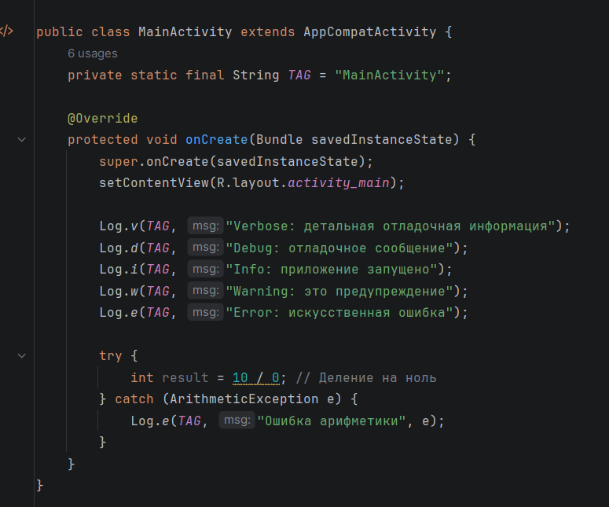

Рисунок 1 - Класс MainActivity / Создание метода OnCreate

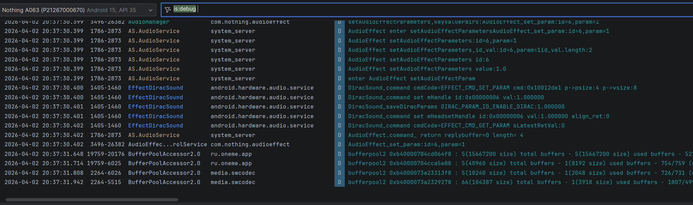

Рисунок 2 - Запуск экрана настройки и "О программе"

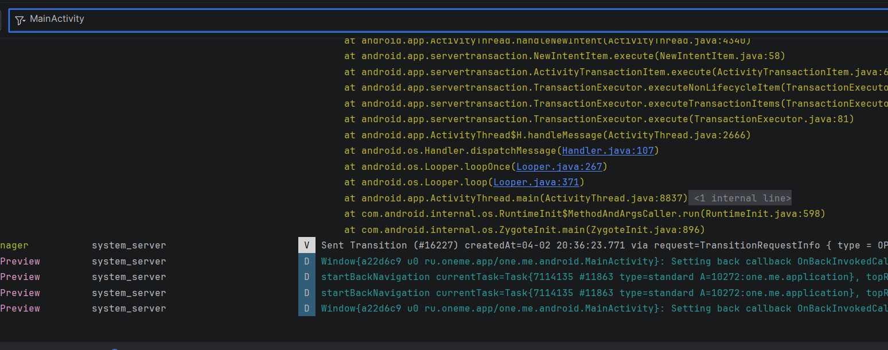

Рисунок 3 – Логика выбора цвета в MainActivity

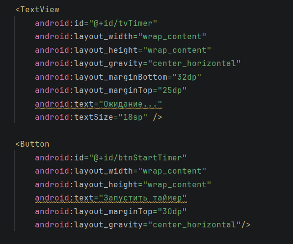

Рисунок 4 – Класс SettingsActivity и метод OnCreate

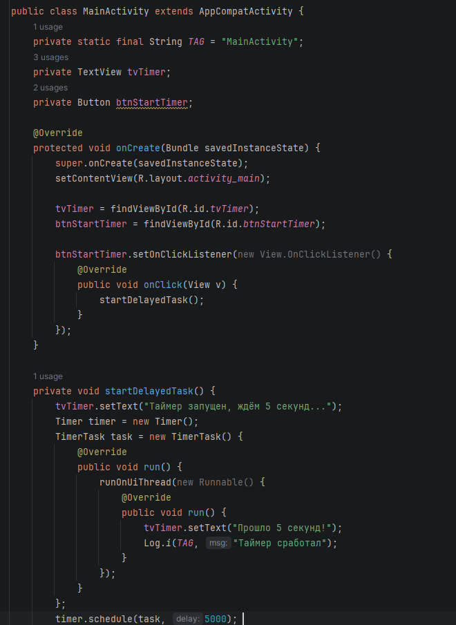

Рисунок 5 – Логика отклика кнопки (флажка) на нажатие

Рисунок 6 – Класс AboutActivity

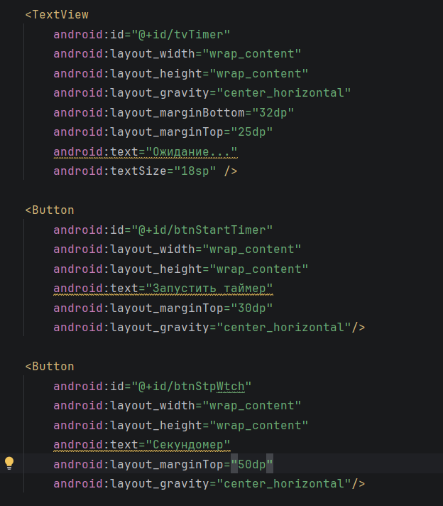

Рисунок 7 – Главный экран

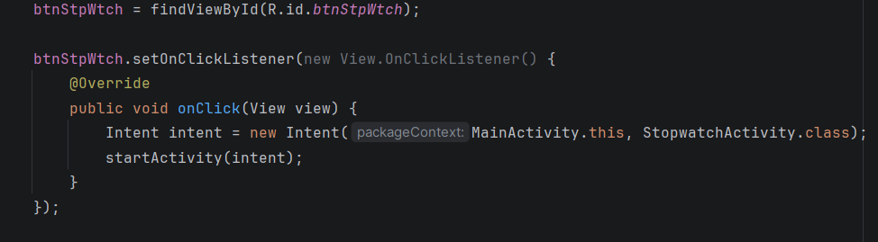

Рисунок 8 – Экран настроек

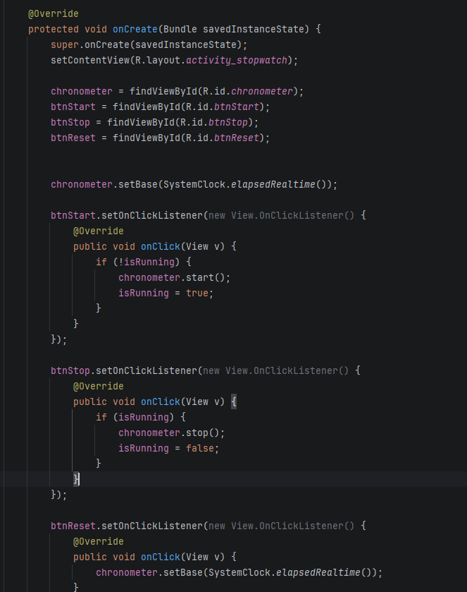

Рисунок 9 – Применение настроек

Рисунок 10 – Экран "Об авторе"

## Индивидуальное задание

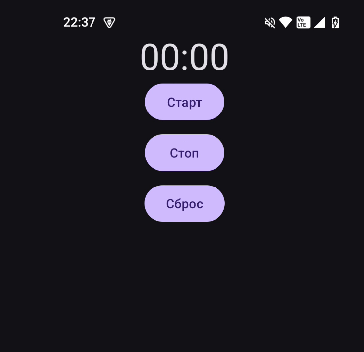

Рисунок 11 - Логика отображения фигур в MainActivity

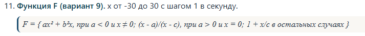

Рисунок 12 - Логика нажатия на кнопку (флажок) в SettingsActivity

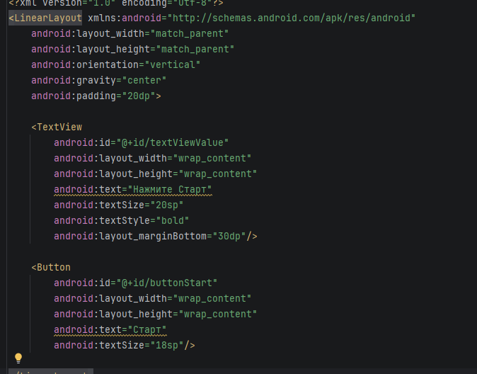

Рисунок 13 - XML файл с кнопками

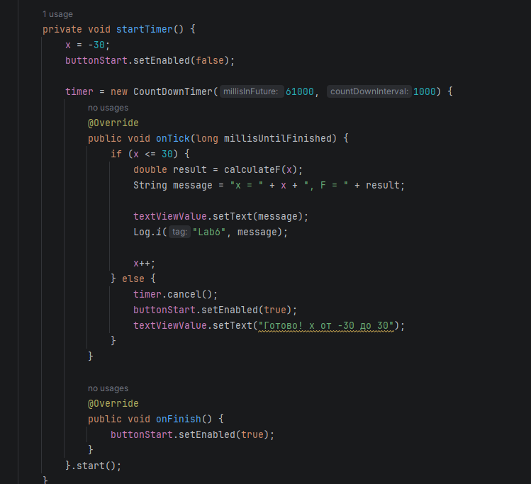

Рисунок 14 - Главный экран

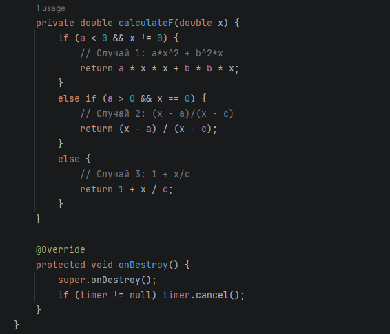

Рисунок 15 - Отображение овала

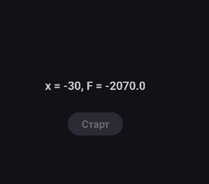

Рисунок 16 - Отображение кольца
